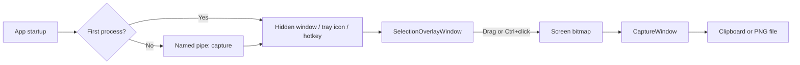

# アーキテクチャ

## 概要

ScreenCapture は、画面の一部またはウィンドウを取得し、常に手前に表示される編集ウィンドウ上でテキスト、別画像、ペイントを重ねる Windows 専用アプリです。MVVM フレームワークは使わず、各 XAML の code-behind が状態とイベントを管理しています。

主要な実行フローは次のとおりです。



`App` に `StartupUri` はありません。`MainWindow` はテンプレート由来の未使用画面で、現在の起動経路には参加しません。

## コンポーネントと責務

| コンポーネント | 主な責務 |
|---|---|
| `App.xaml.cs` | 単一起動、名前付きパイプ、非表示ウィンドウ、通知領域、グローバルホットキー、範囲選択画面の生成 |
| `SelectionOverlayWindow` | 仮想スクリーン全体の暗幕、ドラッグ範囲選択、Ctrl+クリックによる Win32 ウィンドウ選択、`CopyFromScreen` |
| `CaptureWindow` | キャプチャ表示、領域拡張、入力ルーティング、レイヤー順、合成出力、ペイント履歴 |
| `DraggableText` | 埋め込み Noto Sans JP SemiBold によるテキスト編集、移動、選択 UI、文字色・背景色・サイズ、削除 |
| `DraggableImage` | 貼り付け画像の移動、選択 UI、リサイズ、回転、枠、削除 |
| `PaintToolbarWindow` | ペイント色・太さ・矢印・履歴上限の操作をイベントで `CaptureWindow` へ通知 |
| `ColorPickerButton` | 余白のない正方形の色見本ボタン、透明度対応 `StandardColorPicker` Popup、共通の色変更通知 |
| `ThirdPartyLicensesWindow` | EXE に埋め込まれた第三者ライセンス本文の表示 |
| `HotKeyManager` | `RegisterHotKey` / `UnregisterHotKey` と `WM_HOTKEY` の橋渡し |
| `HotKeySettings` | ホットキー設定 JSON の読み書き |
| `TextStyleSettings` | 注釈、ペイント、枠、背景、レイヤー順の設定 JSON の読み書き |

## アプリケーションのライフサイクル

`Application_Startup` は名前付き Mutex `ScreenCapture.SingleInstance` を取得します。

- 最初のプロセスは名前付きパイプの待受を開始し、Win32 メッセージを受ける非表示 WPF ウィンドウと通知領域アイコンを作成します。
- 2 つ目のプロセスは `ScreenCapture.SingleInstancePipe` へ `capture` を送り、終了します。
- ホットキー、通知領域、2 つ目の起動のいずれも、既存プロセスで新しい `SelectionOverlayWindow` を開きます。
- キャプチャ編集ウィンドウを閉じてもアプリは通知領域に残ります。終了は通知領域の `Exit` が担当します。

グローバルホットキーは非表示ウィンドウの HWND へ登録されます。登録に失敗した場合は設定を無効化し、メニュー表示を更新します。

## キャプチャ経路と座標系

プロセスは `app.manifest` で Per-Monitor V2 DPI awareness と `asInvoker` を宣言する。WPF論理座標とWin32の物理ピクセルを変換する既存経路は、このDPIモードを前提に維持し、異なる表示倍率の複数モニターで回帰確認する。

### ドラッグ範囲

`SelectionOverlayWindow` は `SystemParameters.VirtualScreen*` を使って全モニター領域に配置されます。ドラッグ矩形の WPF 座標へ仮想スクリーン原点を加え、`System.Drawing.Rectangle` として `Graphics.CopyFromScreen` へ渡します。

### Ctrl+クリックのウィンドウ取得

クリック位置から `WindowFromPoint`、`GetAncestor(GA_ROOT)`、`GetWindowRect` を使ってトップレベルウィンドウの物理ピクセル矩形を取得します。この経路では WPF の DPI scale をクリック座標へ適用しています。

どちらの経路も暗幕を `Hide()` し、Dispatcher の Render 優先度を通した後に 50 ms 待ってから取得します。この順序は暗幕の混入を防ぐためです。座標変換が経路ごとに異なるため、DPI や複数モニターへ触れる変更では両方を検証します。

取得直後の画像はクリップボードへ入り、同じ `BitmapSource` から `CaptureWindow` が作られます。

## 編集画面の視覚ツリー

`CaptureWindow` の主要な重なりは次の構造です。

```text
CaptureWindow.Content (Grid)
├─ ContentLayer (Grid: 背景色とウィンドウ透明度)
│  ├─ CaptureContent (Grid + TranslateTransform)
│  │  └─ CaptureImage (元のキャプチャ)
│  └─ OverlayCanvas
│     ├─ Line (ペイントと矢印)
│     ├─ DraggableImage
│     └─ DraggableText
├─ BorderFrame と 8 個のリサイズ Thumb
├─ FrameColorPicker / BackgroundColorPicker
├─ MinimizeButton / CloseButton
└─ LayerOrderPanel

PaintToolbarWindow (別の owned window)
```

`ContentLayer` をマウスホイールで 0.01～1.0 の範囲に変更するため、枠や操作ボタンは薄くなりません。ペイントツールバーも別ウィンドウなので合成出力には入りません。

## 領域拡張と座標の維持

キャプチャ後のウィンドウは元画像サイズを `MinWidth` / `MinHeight` とし、四辺・四隅から外側へ広げられます。増えた部分は `ContentLayer.Background` で塗られます。

- 右・下の拡張ではウィンドウサイズだけを変更します。
- 左・上の拡張ではウィンドウ位置も変わるため、元画像へ `_contentOffsetX/Y` の `TranslateTransform` を適用します。
- 同時に `ShiftOverlayElements` が Canvas 上の Line 座標と FrameworkElement の `Canvas.Left/Top` を移動し、元画像との見た目の相対位置を保ちます。

新しいオーバーレイ型を追加するときは、`ShiftOverlayElements` がその座標表現を移動できるか確認が必要です。

## レイヤーと入力ルーティング

レイヤーグループは `Paint = 0`、`Images = 1`、`Text = 2` の enum 値で保存されます。Layers パネルの先頭が最前面です。`ApplyLayerOrder` は先頭から順に 2000、1000、0 のような 1000 刻みの基準 Z-index を割り当てます。

- ペイントの各 `Line` は Paint の基準値を使います。
- 画像とテキストは追加・選択のたびに、それぞれのグループ内カウンターを増やして前面へ移動します。
- グループを並べ替えると、グループ内の相対 offset を保ったまま Z-index を付け替えます。
- ペイントモード中に Paint が Images / Text より上なら、下層の `DraggableImage` / `DraggableText` の `IsHitTestVisible` を false にして Canvas へ入力を渡します。

新しい描画要素を追加する場合は、少なくとも `LayerGroupType`、`IsLayerGroupChild`、`ReindexGroup`、`UpdatePaintLayerHitTesting`、追加時の Z-index を見直します。enum の数値や順序を変える場合は、既存の `text-style.json` に保存された配列の移行も必要です。

## ペイントと履歴

ペイントモードは `Alt` で切り替わり、ツールバーは `CaptureWindow` の下へ追従します。

- フリーハンドはマウス移動ごとに短い `Line` を追加し、1 回の押下から解放までを 1 ストロークとして履歴へ積みます。
- Shift は最初の移動量から水平／垂直を決め、そのストローク中の方向を固定します。
- 矢印は本体 1 本と矢尻 2 本の `Line` で、3 要素を 1 履歴単位として扱います。
- Ctrl キー押下中は一時的に矢印モードへ入り、キー解放で解除します。ツールバーの Arrow toggle からも切り替えられます。
- Undo は要素を Canvas から外し、Redo は同じインスタンスを戻します。

履歴上限を超えると最古ストロークを履歴だけでなく Canvas からも削除します。つまり上限変更は、単に Undo 不能にするのではなく、見えている古い描画を消す現在仕様です。

## コピーと保存

`CopyCompositeToClipboard` と `SaveAsImage` は、選択を解除して補助 UI を一時的に隠し、`CaptureWindow.Content` の Grid 全体を `RenderTargetBitmap` へ 96 DPI で描画します。その後、補助 UI と選択状態を復元します。

出力対象:

- 元のキャプチャ画像
- 拡張領域の背景色
- ペイント
- 貼り付け画像とその設定済み枠
- テキスト

出力対象外:

- キャプチャ枠
- 閉じる／最小化ボタン
- 色選択 UI
- Layers パネル
- テキスト／画像の選択 UI
- 別ウィンドウのペイントツールバー

現在の `SaveAsImage` はダイアログに JPEG 拡張子も表示しますが、実際には常に `PngBitmapEncoder` を使用します。形式対応を拡張する場合は、拡張子と encoder を一致させ、透過背景の扱いも決めてください。

## 設定の永続化

設定ディレクトリは `%APPDATA%\ScreenCapture` です。

| ファイル | 内容 |
|---|---|
| `hotkey-settings.json` | 修飾キー、キー、ホットキー有効状態 |
| `text-style.json` | 文字色、文字背景色、文字サイズ、ペイント色・太さ、画像枠色、キャプチャ枠色、拡張背景色、レイヤー順 |

色は ARGB の `uint`、キーと enum は整数として保存されます。各 public static プロパティの setter が即座にファイルを書きます。読み書き例外は現在握りつぶし、破損・欠損時は既定値へフォールバックします。

設定項目を追加するときは、`Data` に既定値付きプロパティを追加し、旧 JSON をデシリアライズした場合の値を確認します。ファイル名や enum 数値を変える変更には明示的な移行が必要です。

## 外部依存と Windows API

- `PixiEditor.ColorPicker`: `ColorPickerButton` の Popup 内で使用する透明度対応 `StandardColorPicker`（MIT License）
- `System.Drawing.Common`: `CopyFromScreen` と通知領域アイコン周辺
- `Fonts/NotoSansJP-Variable.ttf`: Google Fonts 公式の Noto Sans JP 可変 TrueType。WPF リソースとして EXE に埋め込み、テキスト注釈では SemiBold (600) を選択
- `Fonts/OFL-NotoSansJP.txt`: Noto Sans JP の SIL Open Font License 1.1。埋め込みリソースから `ThirdPartyLicensesWindow` に表示
- WPF / Windows Forms: UI と保存ダイアログ／通知領域
- `user32.dll`: ウィンドウ選択、グローバルホットキー
- Named Mutex / Named Pipe: 単一起動と既存プロセスへの通知

`UseWPF` と `UseWindowsForms` の両方が有効です。同名型の衝突があるため、既存コードは `WpfPoint`、`WpfColor`、`WpfMouseEventArgs` などの alias を使っています。

## 変更箇所の探し方

### 新しいショートカット

`CaptureWindow.OnKeyDown` が編集画面の中心です。ペイントツールバーがフォーカスを持つ場合は `PaintToolbarWindow.OnPreviewKeyDown` も確認します。`KeyDown` と `PreviewKeyDown` の両方へ同じ handler が登録されているため、1 回だけ発火することを手動確認します。

### 新しいオーバーレイ要素

追加、選択解除、削除、前面移動、レイヤー判定、ペイント中のヒットテスト、領域拡張時の移動、コピー／保存時の操作 UI 非表示を一式で設計します。

### 新しい設定

設定クラスの `Data`、公開プロパティ、既定値、保存タイミングを追加します。設定 UI と起動時の適用箇所も同じ変更に含めます。

### 新しいキャプチャ方式

仮想スクリーン原点、DPI、物理ピクセル矩形、オーバーレイ非表示、クリップボード、`CaptureWindow` の初期位置までを一つの経路として実装します。

## 既知の制約と改善候補

- 自動テストがなく、DPI、複数モニター、クリップボード、Win32 API は手動回帰に依存する。
- `CaptureWindow.xaml.cs` に多くの責務が集中している。大きな機能追加では、合成レンダリング、レイヤー管理、ペイント履歴などの分離を検討する。
- コピーと保存に同じ「補助 UI を隠す／復元する」処理が重複し、例外時の復元を `finally` で保証していない。
- 保存ダイアログの拡張子と PNG 固定 encoder が一致していない。
- 設定、単一起動、ホットキー周辺には例外を記録しない catch があり、障害解析が難しい。
- `MainWindow` と未使用の起動補助メソッドが残っている。削除時は XAML の Application 設定と起動経路を再確認する。
- GitHub Actionsはビルドと初回未署名Releaseまでを自動化している。SignPathの署名要求と署名済みArtifactへの差し替えは、Foundation承認後に組織固有の設定を使って追加する。
- Microsoft Store版は、自己完結のx64発行物をfull-trust desktop MSIXへ格納する。`runFullTrust` は画面キャプチャ、グローバルホットキー、通知領域、クリップボードなど既存のWin32経路を維持するために必要だが、実行整合性レベルは `mediumIL` で管理者権限を要求しない。Store IdentityはPartner Centerの値をビルド時に注入する。
